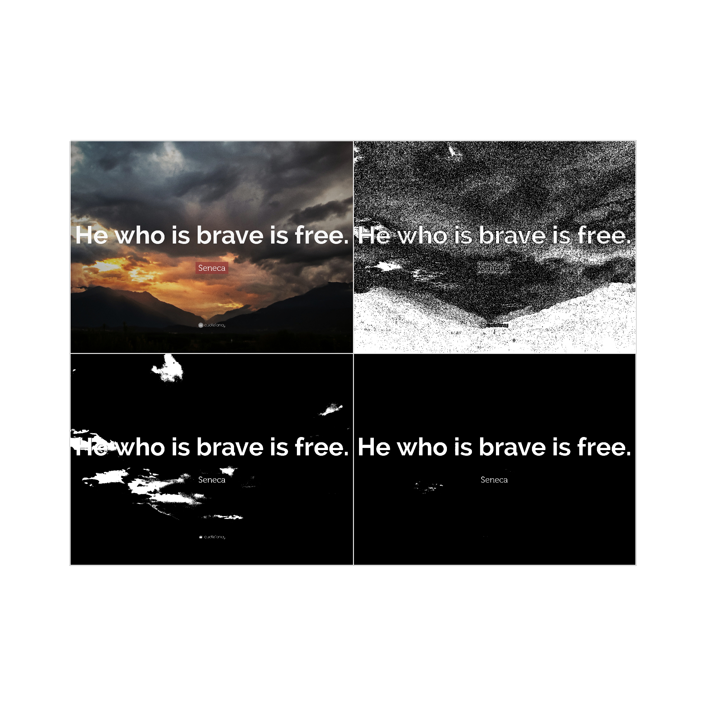
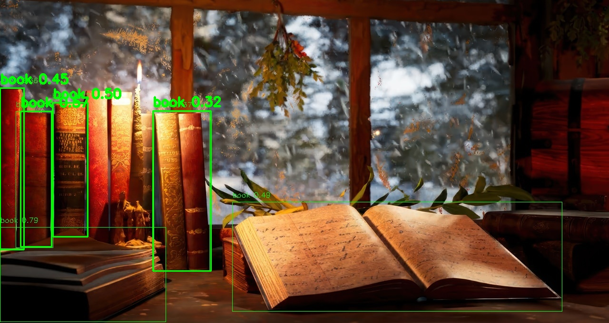
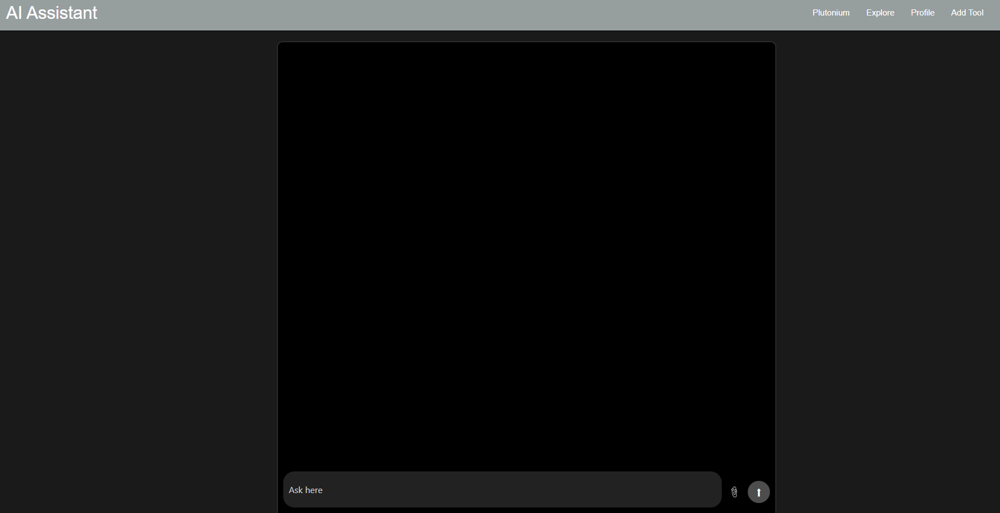
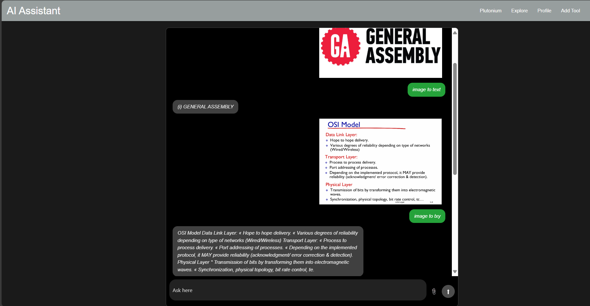
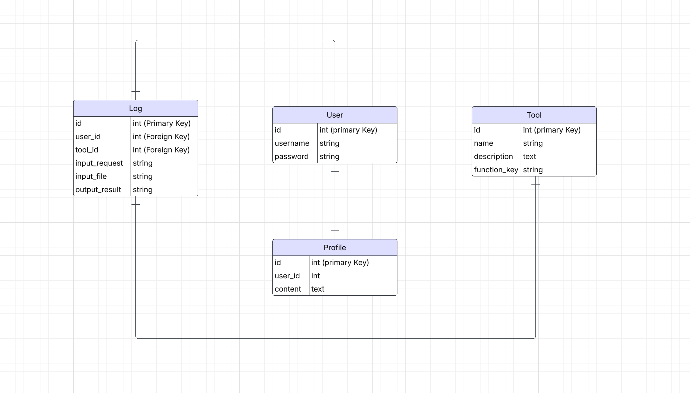
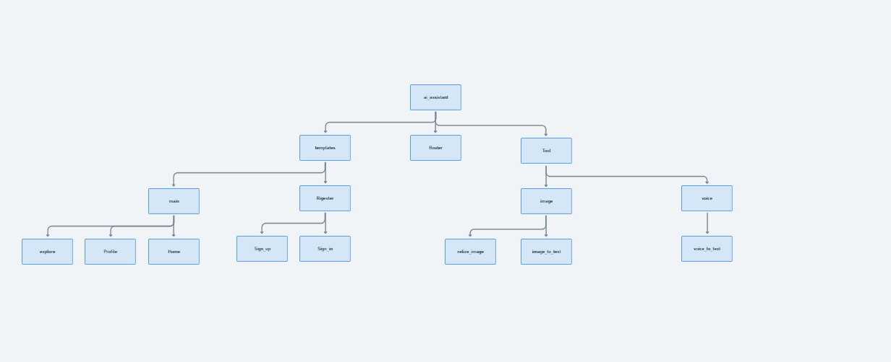

# Ai-Assistant

## [Deploy Link](#)

# **Ai Assistant Plutonium** 

### **Plutonium** Plutonium is user-friendly for performing tasks, and developer-friendly for adding new functions, the structure and how everything integrates is designed so developers can easily add functions and new features.

### **Why Plutonium** Because you can add your own custom functions, the idea is to integrate developers with AI and let users take advantage of these new functions, if you can think of a feature, you can add it.

### **Overview**: An AI Assistant where the user can type the feature they need to run, and the app will decide the closest matching function from the available ones.  

### **Technology**: The project is built with Python. The functions are not written entirely from scratch but organized to be reusable and extendable.  

### **Core Idea**: The heart of the project is machine learning — understanding both the theory and the technical side, and learning how to perform the functions effectively.  

## ORC (image to text ) Process 
### 

## Object detection 
### 
   

## Screen Shot from app
### 
### 
### 

## Technology used

### - **PyTorch** deep learning framework powering AI models.  
### - **OpenCV** image processing and computer vision.  
### - **Transformers (HuggingFace)** ready NLP models for text tasks.  
### - **Django** framework for building the web interface.  
### - **Scikit-learn** classic machine learning algorithms.  
### - **Pandas & NumPy** data handling and numerical operations.  
### - **Matplotlib**  visualization and plotting.  
### - **PostgreSQL (psycopg2)** database support.  

## ERD

## Component hierarchy

### Notion for Task
### Obsidian for nots
## [Notion Link](https://www.notion.so/1a9fcd547d3180a99177c3abfa077934?v=248fcd547d3180c68a78000ca4239520&source=copy_link)

## Create a virtual environment and install dependencies
#### make sure to install python 3.11
#### py -3.11 -m venv .venv
#### source venv/bin/activate (Linux / Mac) or venv\Scripts\activate (Windows)
#### pip install -r requirements.txt

## Developer notes
#### the structure is built to be user friendly and developer friendly
#### to add a tool focus on: router.py, TOOLS, FUNCTION_MAP
#### in TOOLS add function name + examples ['image to text', 'convert this image to text'] 
#### NLP understands the meaning, it doesn’t have to be an exact match
#### import the function first
#### then in FUNCTION_MAP add function name and location

## Future enhancements 
### Make the system flexible to read/handle any type of input (e.g. voice, video).
### Discover and add more tools 

## Resources
#### [YOLO](https://docs.ultralytics.com/tasks/detect/)
#### [pytesseract](https://pypi.org/project/pytesseract/)
#### [Python Tutorials for Digital Humanities](https://www.youtube.com/watch?v=tQGgGY8mTP0&list=PL2VXyKi-KpYuTAZz__9KVl1jQz74bDG7i)
#### [SentenceTransformer](https://www.sbert.net/)
#### [Edje Electronics](https://youtu.be/r0RspiLG260?si=x_PaC4_akxAKhE4z)
#### [How YOLO Object Detection Works](https://youtu.be/svn9-xV7wjk?si=1oGLUHvlfO0oRfEu)
#### [ProgrammingKnowledge](https://www.youtube.com/watch?v=9nUNPrvCFAE&list=PLHgvmbajt-ByUdTiXe3Epzm1k2TIZAesg)
#### [Nicholas Renotte](https://www.youtube.com/@NicholasRenotte)
#### [Vizuara](https://youtu.be/lcArnTfpPBM?si=EhY_bgx-kUC61Q5e)
#### [codebasics](https://youtu.be/IfRMV2MY9n0?si=i_Mvo39cDSAf3KXo)
